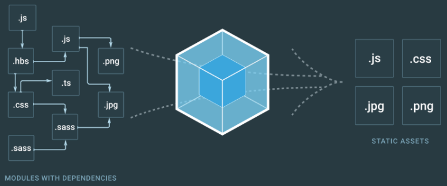

# webpack-practice

최신 frontend 프레임워크에서 가장 많이 사용되는 모듈 번들러이다. 매우 꼼꼼한 구성이며 중/대형 프로젝트에 적합하다.



## 모듈 번들러

웹 애플리케이션을 구성하는 HTML, CSS, JS 등을 모두 각각의 모듈로 보고 이를 조합해서 하나의 결과물을 만드는 도구를 의미한다.

## 모듈

- 프로그래밍 관점에서 특정 기능을 갖는 작은 단위, 비슷한 기능들을 하나의 의미 있는 파일로 관리하면 모듈이라 할 수 있다.

- webpack에서 모듈은 js로 한정되어 있지 않고 웹 애플리케이션을 구성하는 모든 자원을 의미한다.

### 파일 단위의 모듈 관리의 필요성

- 웹 애플리케이션을 만들 때 여러 개의 js파일을 사용한다. 이때 여러 개의 js파일들이 서로 간섭하는 오류가 발생할 수 있는데,webpack을 사용하면 서로 간섭하는 문제를 해결 할 수 있다.

### 웹 애플리케이션의 빠른 로딩 속도와 높은 성능

- 빠른 로딩 속도를 위해 브라우저에서 서버로 요청하는 파일들의 숫자를 줄이는 행위를webpack을 통해 파일들을 압축하는 작업을 통해 진행한다.

### webpack의 4가지 주요 속성

1. entry : 웹 자원은 변환하기 위해 필요한 최초 진입점. (js파일 경로)
2. output : webpack의 동작이 끝나고 생긴 결과물의 파일 경로.

   ```
   const path = require("path");

   module.exports = {
   output: {
   	filename: "bundle.js",
   	path: path.resolve(__dirname, "./dist")
   }
   };

   // 최소한 filename은 정의 해줘야 하며 일반적으로 path 속성을 함께 정의한다.
   // filename은 webpack으로 빌드한 파일의 이름을 의미하고, path는 해당 파일의 경로를 의미한다.
   ```

3. loader : webpack이 웹 애플리케이션을 해석할 때 웹 자원들을 변환할 수 있도록 도와준다.
4. plugin : 추가적인 기능을 제공할 수 있도록 도와준다.plugin에는 생성자 함수로 생성한 객체 인스턴스만 추가할 수 있다.
